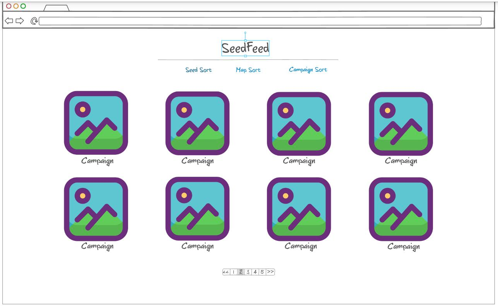
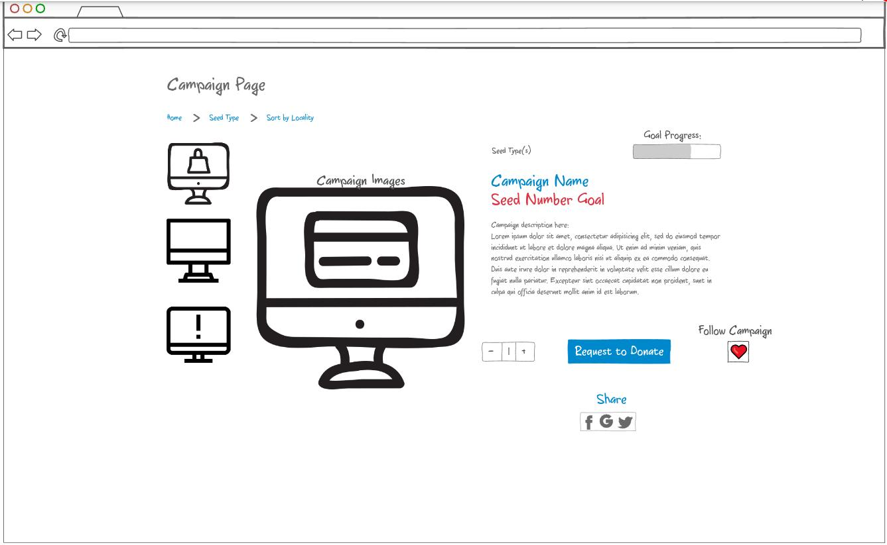

# Startup - RootRevolution
### "Growing Change from the Ground Up" (Literally)
## Elevator Pitch
RootRevolution put simply is a seed crowdfunder- the farmer friendly fundraising website that the world has been waiting for. Inspired by my family members who always have leftover seeds and don't know what to do with them, RootRevolution is a crowdfunding-based website where users with a surplus of seeds can donate their unsused seeds towards any cause, whether it be a community-focused or a global movement. That way, you can participate and be a part of something bigger without having to donate costly supplies or spend lots of money. RootRevolution connects you with anyone who has a need for seed, from solo-sowers and school gardens to larger community and global humanitarian organizations so that they can get the supplies they need to make a difference in any way from simply teaching valuable agricultural lessons or fighting hunger by providing food for those who need it most.
https://startup.rootrevolution.store

## Design
Each user has their own SeedFeed that shows them campaigns that they could support

Each campaign also gets its own page:

## Key Features
- Users have their own accounts to track their seed donations
- Donations can be tracked so users can grow their Seed Count
- Users can join a specific movement or organization to become more involved
- Connects users locally to make seed handling more convenient
- Users can request and start their own project and campaign
- Larger organizations can designate people on a local level to collect and receive seeds
- A map that users can opt into to see those around them who donated or need seeds

## Technologies
- HTML - uses HTML pages: one for login, one for a homescreen, one for each campaign, amd one for each user, and one for a seed map
- CSS - uses CSS to style the website for desktop and mobile users
- JavaScript - handles login, searching for campaigns, starting a campaign, and editing ones profile
- Service - Backend service with endpoints for:
  - login
  - retrieving campaigns
  - creating a campaign
  - requesting to donate seeds
  - retrieving seed map
- DB/Login - Store users, campaigns, and seed counts. Register and login users, and credentials securely stored in a database. Can request to donate without authentication, but email is required and seed count will not grow
- WebSocket - As campaigns are created, they are shown on the homescreens or the "SeedFeeds" of other users
  
## HTML Deliverable
For this deliverable I built the structure of my application using HTML
- [x] HTML pages: one for login, one for a homescreen, one for each campaign, amd one for each user, and one for a seed map
- [x] Links: there is a working nav menu with links to each page and links from the homescreen to each campaign
- [x] Forms: there is a login form and a form to create a campaign
- [x] Images: there are images on the homescreen of campaigns
- [x] Tables: there is a table on the page of campaigns
- [x] DB/Login: Input box and submit button for login. The user info and campaign info represent data pulled from the database.
- [x] WebSocket: The WebSocket is used to update the homescreen with new campaigns

## CSS Deliverable

- [x] Prerequisite: Simon CSS deployed to your production environment
- [x] Prerequisite: A link to your GitHub startup repository prominently displayed on your application's home page
- [x] Prerequisite: Notes in your startup Git repository README.md file
- [x] 30% Header, footer, and main content body: Used grid to layout homescreen sections
- [x] 20% Navigation elements: Nice nav menu effects and transitions
- [x] 10% Responsive to window resizing: Looks great on iPad, desktop, and iPhone
- [x] 20% Application elements: Buttons have nice styling and the homescreen is tiled
- [x] 10% Application text content: Text is colored and themed after my deliverable
- [x] 10% Application images: I made sure images were resizable and wouldn't ever be too large

## JavaScript Deliverable
- [x] Prerequisite: Simon JavaScript deployed to your production environment
- [x] Prerequisite: A link to your GitHub startup repository prominently displayed on your application's home page
- [x] Prerequisite: Notes in your startup Git repository README.md file
- [x] 20% JS Login: The user and password are set in local storage and the user is redirected to the homescreen, requires you to input both a username and password and gives an error banner if not
- [X] 20% JS Database Data: Recalls personal user data and displays it on the account page, and campaign info on campaign page *For now, it is only implemented in local storage*
- [X] 20% JS WebSocket: I used the setInterval function to periodically increase the "sitewide donation seed count" by a random amount. This will be replaced with WebSocket service calls later.
- [X] 40% JS Application Interaction Logic: Login nav menu item and Account nav item were merged. If you aren't logged, in the nav menu displays Login and if you are logged in, it displays your username and a Logout button. Added disappearing informational banners at the top of the page

## Service Deliverable
- [X] Prerequisite: Simon Service deployed to your production environment
- [X] Prerequisite: A link to your GitHub startup repository prominently displayed on your application's home page
- [X] Prerequisite: Notes in your startup Git repository README.md file documenting what you modified and added with this deliverable
- [X] Prerequisite: At least 10 git commits spread consistently throughout the assignment period
- [X] 40% - Create an HTTP service using Node.js and Express
- [X] 10% - Frontend served up using Express static middleware
- [X] 10% - Your frontend calls third party service endpoints: I applied for an API license for a service that measures the carbon footprint and energy impact of my site and displays it for the users. They haven't given me an API key yet but I put a random quote generator in as a placeholder
- [X] 20% - Your backend provides service endpoints: I added commented out code sitewide to handle things like the seed donation counter, and left it commented out as it depends on a database which isnt implemented yet
- [X] 20% - Your frontend calls your service endpoints: I added commented out code sitewide to handle things like the seed donation counter, and left it commented out as it depends on a database which isnt implemented yet

## Login Deliverable
- [X] Prerequisite: Simon Login deployed to your production environment with your dbConfig.json credentials
- [X] Prerequisite: A link to your GitHub startup repository prominently displayed on your application's home page
- [X] Prerequisite: Notes in your startup Git repository README.md file documenting what you modified and added with this deliverable. The TAs will only grade things that have been clearly described as being completed. Review the voter app as an example.
- [X] Prerequisite: At least 10 git commits spread consistently throughout the assignment period.
- [X] 20% - Supports new user registration
- [X] 20% - Supports existing user authentication
- [X] 20% - Stores application data in MongoDB
- [X] 20% - Stores and retrieves credentials in MongoDB- clicking on the users name will take you to a page with their account info
- [X] 20% - Restricts application functionality based upon authentication- users can't donate seeds or view account info without logging in

## WebSocket Deliverable
- [X] Prerequisite: Simon WebSocket deployed to your production environment
- [X] Prerequisite: A link to your GitHub startup repository prominently displayed on your application's home page
- [X] Prerequisite: Notes in your startup Git repository README.md file documenting what you modified and added with this deliverable. The TAs will only grade things that have been clearly described as being completed. Review the voter app as an example.
- [X] Prerequisite: At least 10 git commits spread consistently throughout the assignment period.
- [X] WebSocket support for data pushed from the backend
- [X] 20% - Backend listens for WebSocket connection- websocket is set up to listen for connections in index.js
- [X] 20% - Frontend makes WebSocket connection- websocket is set up to connect to backend each page's respective .js file
- [X] 30% - Data sent over WebSocket connection- connected clients are counted and the variable clientCount is sent over the websocket connection so everyone can see how many people are currently on the site
- [X] 30% - WebSocket data displayed in the application interface- clientCount is displayed on each page in the footer

## React Deliverable
- [X] Prerequisite: Simon React deployed to your production environment
- [X] Prerequisite: A link to your GitHub startup repository prominently displayed on your application's home page
- [X] Prerequisite: Notes in your startup Git repository README.md file documenting what you modified and added with this deliverable. The TAs will only grade things that have been clearly described as being completed. Review the voter app as an example.
- [X] Prerequisite: At least 10 git commits spread consistently throughout the assignment period.
- [X] Application converted to use React
- [X] 10% Bundled using Vite
- [X] 30% Multiple functional react components
- [X] 30% React router
- [X] 30% React hooks- used useNavigate to navigate without reloading and useEffect to run things only once on page load